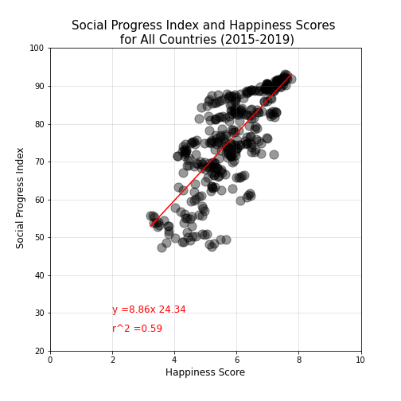
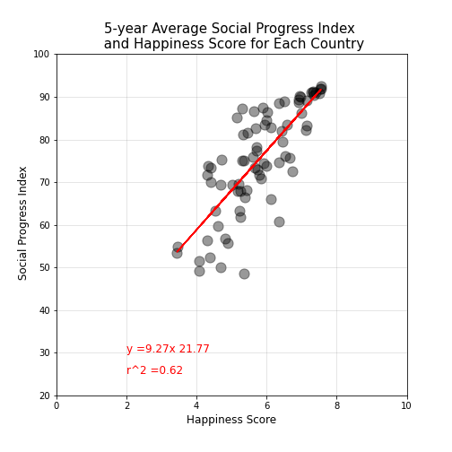
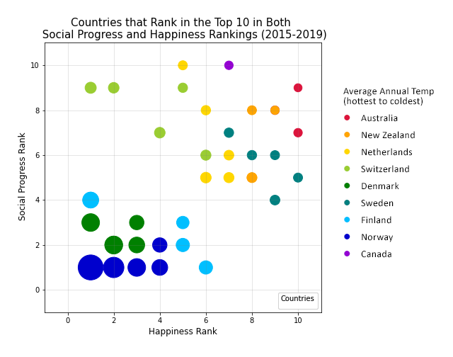

NOTE: The original shared repository can be found here: https://github.com/chrispope12391/Project-1-

---

# Does Social Progress Relate To Happiness?

## Project 1: Nick Buller, Kerry Harp, Sofanit Mengesha, Christopher Pope

### Hypothesis

There is a positive relationship (correlation) between the Happiness Score and the Social Progress Index (score).

- We assume "Basic Human Needs" is the greatest Social Progress indicator that predicts Happiness.

- We assume "Healthy Life Expectancy" is the greatest Happiness indicator that predicts Social Progress Score

- We assume a high population density correlates to high scores in both SP and HS.

World Happiness Report (https://worldhappiness.report/)

Social Progress Index (https://www.socialprogress.org/)

Population Density (https://population.un.org/wpp/Download/Standard/Population/)
